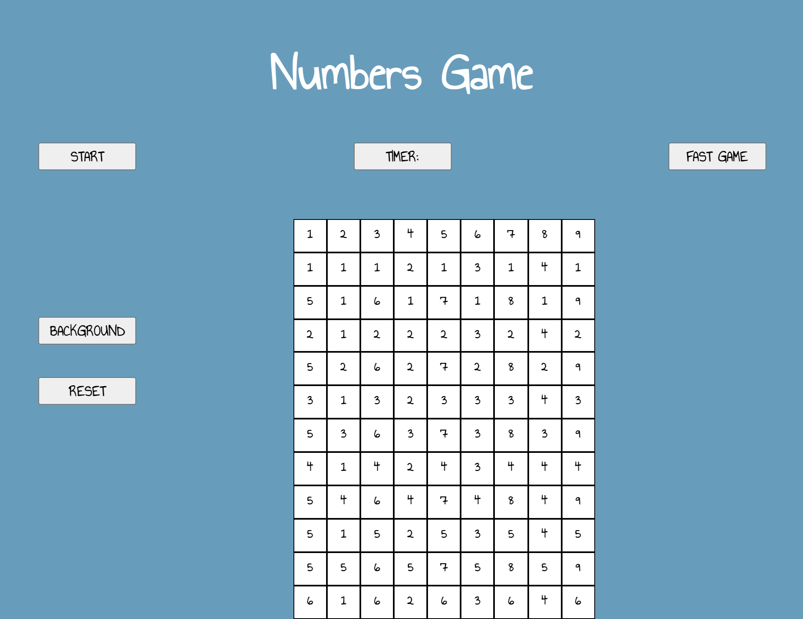
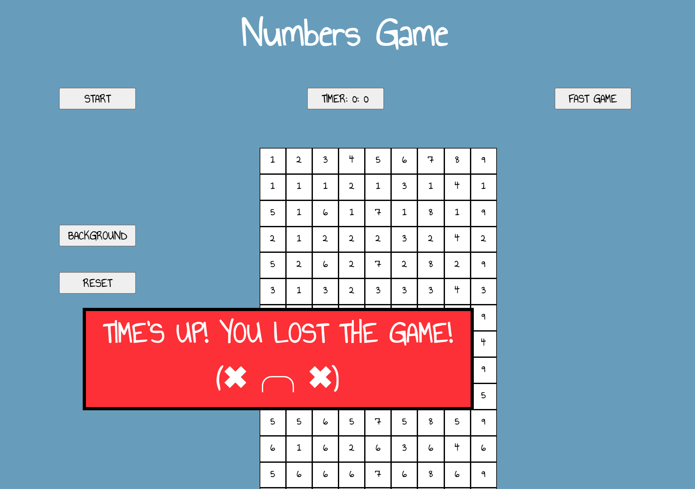

# Numbers Game

#### *Numberama*, also known as *Take Ten*, or simply *Numbers Game* is a number matching puzzle game. 

There isn't much information on it online and I learned to play it years ago during math class, ironically, while not doing math. 

####Technologies Used: 
The whole game is built solely using JavaScript, HTML and CSS, although JavaScript does majority of the work.

#### Getting Started: 

[Numbers Game](https://liiss-j.github.io/numbers-game/)

The gameplay is simple- clear the board by selecting two numbers that match in value or add to ten. Both numbers must be adjacent (you can also match the last number of a row with the first number next row over). Each matched number will be crossed off and won't be usable again. You win when the gameboard is empty.
To make gameplay more exciting, you can play the fast game which sets a 15-minute timer and you have to clear the grid before the timer runs out.

####Planned future enhancements:

* The game is still missing a dynamic grid where all the leftover numbers are added back to the grid in the order they apppear.
* The number comparison function needs another feature that makes sure only adjacent numbers make a match
* Minor bug fixes